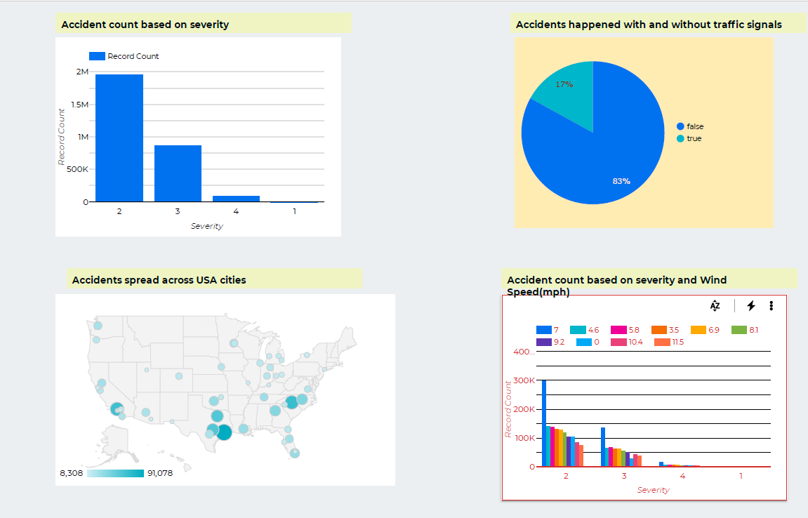
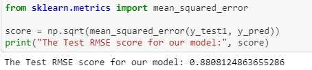

<h1 align = "center"> Severity Prediction of Car Accidents in US </h1>

 

 
## Team Name: Quarantine Buddies

Team Members: 
1)Aditya Bandaru 
2)Anusha Balumuri 
3)Ranga Sai Pavan Kiran Vipparla 
4)Sandeep Bellary 
5)Siri Chandana Sureddi 

## Project Description 
- An accident is an uncontrollable incident which happens at times. So our project is focused on “ Car accidents in US” 
- This dataset has been collected in real-time, using multiple Traffic APIs. Currently, it contains accident data that are collected from February 2016 to December 2019 for the Contiguous United States.
- With this dataset we are going to predict the severity using factors such as day, weather, county, state, and various other factors.
- The main audience for this project is civilians and state traffic department. This may help them in containing those accidents..

### 1. Research Question
Road Accidents are a common cause of death, disability, collateral destruction and a significant public health and road safety problem. Accidents are also a significant cause of congestion and delays in the flow. On average, nearly 5,000 people are killed and over 418,000 people are injured in weather-related crashes each year. Being one of the major steps of accident management, accident severity prediction can provide crucial information for emergency responders to evaluate the severity level of accidents, estimate the potential impacts, and implement efficient accident management procedures.

Therefore, we propose a solution to deal with the increased attention that has been directed at accident severity prediction using modeling techniques like Bayesian network and Regression models.  

### 2. Domain and Data: Data Description

#### A. Source and Size of Data
Dataset link: https://www.kaggle.com/sobhanmoosavi/us-accidents

This is a countrywide car accident dataset, which covers 49 states of the United States. The accident data are collected from February 2016 to December 2019, using several data providers, including two APIs that provide streaming traffic incident data. These APIs broadcast traffic data captured by a variety of entities, such as the US and state departments of transportation, law enforcement agencies, traffic cameras, and traffic sensors within the road-networks. Currently, there are about 3.0 million accident records in this dataset.
- ID - This is a unique identifier of the accident record.
- Source - Indicates source of the accident report (i.e. the API which reported the accident.).
- TMC - A traffic accident may have a Traffic Message Channel (TMC) code which provides more detailed description of the event.
- Severity - Shows the severity of the accident, a number between 1 and 4, where 1 indicates the least impact on traffic (i.e., short delay as a result of the accident) and 4 indicates a significant impact on traffic (i.e., long delay).
- Start_Time - Shows start time of the accident in local time zone.
- End_Time - Shows end time of the accident in local time zone.
- Distance(mi) - The length of the road extent affected by the accident.
- City - Shows the city in address field.
- County -Shows the county in address field.
- State - Shows the state in address field.
- Zipcode - Shows the zipcode in address field.
- Country - Shows the country in address field.
- Timezone - Shows timezone based on the location of the accident (eastern, central, etc.).
- Weather_Timestamp - Shows the time-stamp of weather observation record (in local time).
- Temperature(F) - Shows the temperature (in Fahrenheit).
- Wind_Chill(F) - Shows the wind chill (in Fahrenheit).
- Humidity(%) - Shows the humidity (in percentage).
- Pressure(in) - Shows the air pressure (in inches).
- Wind_Direction - Shows wind direction.
- Wind_Speed(mph) - Shows wind speed (in miles per hour).
- Precipitation(in) - Shows precipitation amount in inches, if there is any.
- Weather_Condition - Shows the weather condition (rain, snow, thunderstorm, fog, etc.).

##### Exploratory Data Analysis
- We use Cloud AutoML and will be exploring the data
- For each observation, important subsets are identified
- Interrelationships between various attributes will be observed
- Guessing for possible associations between target variable and predictors
- Looking for associations among the predictors
 

##### Preprocessing Phase
- We will find and remove all the outliers in the dataset by looking all the columns and finding the values that are very different from the rest of them.
- We will look for various features to find the most relevant ones to use them for predictions like ‘Weather_Timestamp’, ‘Severity’ , etc., from the dataset.
- We will learn what are the columns that are least significant like ‘End_Lng’ and ‘End_Lat’ columns in the dataset and remove them.
- We will use Cloud Dataflow, Google Dataprep and Google Dataproc for cleaning the data and pre-processing the dataset
 

##### Dashboard for Users
- A Dashboard is created for users.
- Users dashboard is included with action-oriented features as make it easier for them which will help them refer to or look at what they desire.

 

#### AutoML Modelling Results
 

 
##### Modelling Techniques
- We have used various models like LinearRegression,Logistic Regression and Light GBM.
- By using Linear Regression model we obtained a accuracy of around 67% and with Logistic Regression we got around 66%.
- So, we have used the Light GBM model which resulted in the accuracy of 88%.

##### Why LightGBM

-Light GBM is a high-performance and distributed decision tree-based system used for classification, ranking and many other forms of machine learning tasks. 

-The primary benefit of the LightGBM is the algorithm improvements that significantly speed up the process and also contribute to the creation of an efficient model.

-Since it is based on decision tree algorithms, it splits the tree leaf wise with the best fit whereas other boosting algorithms split the tree depth wise or level wise rather than leaf-wise. So when growing on the same leaf in Light GBM, the leaf-wise algorithm can reduce more loss than the level-wise algorithm and hence results in much better accuracy which can rarely be achieved by any of the existing boosting algorithms. Also, it is surprisingly very fast, hence the word ‘Light’.

##### Advantages of Light GBM

- Faster training speed and higher efficiency.
- Lower memory usage.
- Better accuracy than any other boosting algorithm.
- Compatibility with Large Datasets.

<a href="Accident Severity.ipynb">VIEW JUPYTER NOTEBOOK HERE !!!</a>

 
 ##### RESEARCH CITATIONS:

- Moosavi, Sobhan, Mohammad Hossein Samavatian, Srinivasan Parthasarathy, and Rajiv Ramnath. “ A Countrywide Traffic Accident Dataset.”, 2019.
https://arxiv.org/pdf/1906.05409.pdf

-	Moosavi, Sobhan, Mohammad Hossein Samavatian, Srinivasan Parthasarathy, Radu Teodorescu, and Rajiv Ramnath.” Accident Risk Prediction based on Heterogeneous Sparse Data: New Dataset and Insights” In proceedings of the 27th ACM SIGSPATIAL International Conference on Advances in Geographic Information Systems, ACM, 2019. 
https://arxiv.org/pdf/1909.09638.pdf

-	Sachin Kumar1* and Durga Toshniwal2 . “A data mining framework to analyze road accident data”
https://link.springer.com/content/pdf/10.1186/s40537-015-0035-y.pdf

-	Liling Li, Sharad Shrestha, Gongzhu Hu. “Analysis of Road Traffic Fatal Accidents Using Data Mining Techniques” 
https://ieeexplore.ieee.org/stamp/stamp.jsp?tp=&arnumber=7965753

-	Omer Dawelbeit, Rachel McCrindle. “A Novel Cloud Based Elastic Framework for Big Data Preprocessing “ https://www.researchgate.net/publication/268218832_A_Novel_Cloud_Based_Elastic_Framework_for_Big_Data_Preprocessing

ABSTRACT: 
Traffic safety is one of the major concerns and an important challenge for the normal public and the authorities. So, it is helpful to know what factors caused majority of accidents in that particular region, to propose accurate rules and suggestions that could potentially reduce the accidents rate. The dataset we are dealing with is a large-scale dataset rather than small scale datasets with limited coverage. This dataset is collected through a broad process of data-collection, integration and augmentation. The data is provided using numerous data providers which includes two APIs that deliver streaming traffic event data. Since, the data is huge it is vital to pre-process the data to identify the significant factors related to traffic accidents which could be done using the Data Mining techniques available. We can apply ML techniques and the tools available on this pre-processed data to perform the analysis and achieve the results to predict the factors that are responsible for several accidents. 

#### Tentative plan for analysis on GCP:

##### EDA and Preprocessing - Completed 

##### Dashboard for User group - Completed

##### GCP Modelling - Completed

##### Evaluation of Results- Completed

